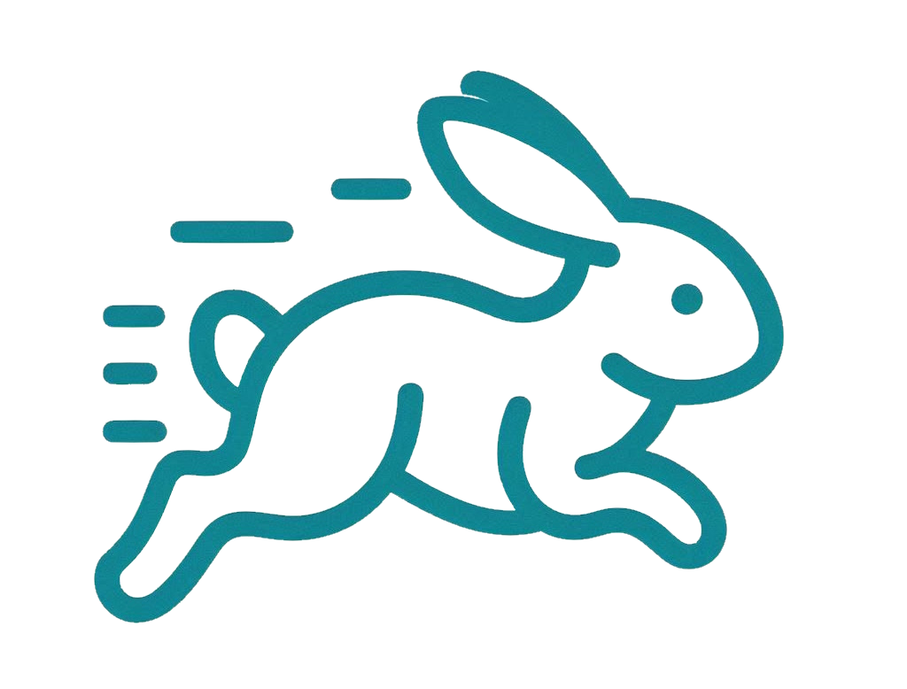

<div align="center">
    
    <h2>Bunny</h2>
    <b>An interpreted language to generate vector-graphics.</b>
</div>

---

```clojure
(
    (def fib (n) 
		(foldl
			(\ (acc num) (
				(def l (len acc))
				(def f1 (get acc (- l 1)))
				(def f2 (get acc (- l 2)))
				(append acc (+ f1 f2))
			))
			[0 1]
			(range 0 n)
		)
	)

	(fib 10)
)
```
(for more examples, see the `examples/` directory or the tests)

## Installation

install via `cargo`:

```bash
cargo install bunny
```

... or clone the repo and compile it yourself:

```bash
# Note that cargo should've been installed via rustup and a C compiler must be in the path for this to work
cargo +nightly build --release 
```