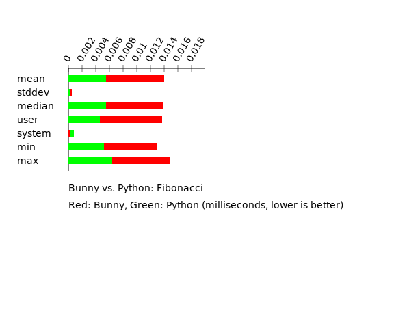

# Bunny
<bunny logo here>

---

is an

- immutable
- deterministic
- functional
- interpreted
- lazy
- statically-typed
- strongly-typed

language for creating graphs.

---

# Show me the code.

---
# Yes, it's a LISP.

_(Without homoiconicity)_

```lisp
(def fib (n) 
    (foldl
        (\ (acc num) (
            (def l (len acc))
            (def f1 (get acc (- l 1)))
            (def f2 (get acc (- l 2)))
            (append acc (+ f1 f2))
        ))
        [0 1]
        (range 0 n)
    )
)

(fib 20)
```

---

# Quick Technical Rundown

---

# Lexer, Parser, Scoping

- Extremely simple due to minimal syntax of the language (`def` and `\` as the **only** keywords!)
- Variable declaration and visibilty checking done in a single pass (enforced define before use)

---

- Lexer / Parser written in `pest`:

```
program = _{ SOI ~ func_call ~ EOI }

expr = { 
	 float 
	 | int 
	 | string 
	 | array 
	 | dict
	 | func_call 
	 | color 
	 | identifier
}
```

---

# Typechecker

Implements Hindley-Milner's _Algorithm J_

```lisp
; Can infer generics
(def arr [[1 2] [3 4] [5 6]]) ; array[array[int]]

; Does not require type annotations, even for complex types
(def last (a) (get a (- (len a) 1)))
(def first-of-last (compose1 last first)) ; array[array['6]] -> '6

; Supports let-polymorphism
(def id (x) x) 
(get (id [1 2 3]) (id 0)) ; => 1
```

---

# Runner

- Converts the AST into an IR that rust can run:
```rust
pub type LazyType<T> = Arc<LazyCell<T, Box<dyn FnOnce() -> T>>>;

#[derive(Debug, Clone)]
pub enum Lazy {
    Int(LazyType<i64>),
    Float(LazyType<f64>),
    String(LazyType<ImString>),
    Color(LazyType<Srgba<u8>>),
    Opaque(LazyType<Element>), // internal repr of SVGs
    Array(LazyType<Vector<Lazy>>),
    Dict(LazyType<HashMap<Value, Lazy>>),
    Lambda(LazyType<LazyLambda>),
}
```

---

- Result: A tree of function-pointers (`LazyCell`s)!
- Control structures are implemented using laziness: 

```rust
#[forall a | cond:int() => iftrue:a => iffalse:a => ret:a]
fn "if"(Lazy::Int(cond), iftrue, iffalse){
    lazy!([iftrue -> i1, iffalse -> i2], {
        if eval!(cond) != 0 {
            eval!(i1)
        } else {
            eval!(i2)
        }
    })
}
```

- (`if` is just a function)

---

# Fibonacci

notice something?



---

# Demo Time


